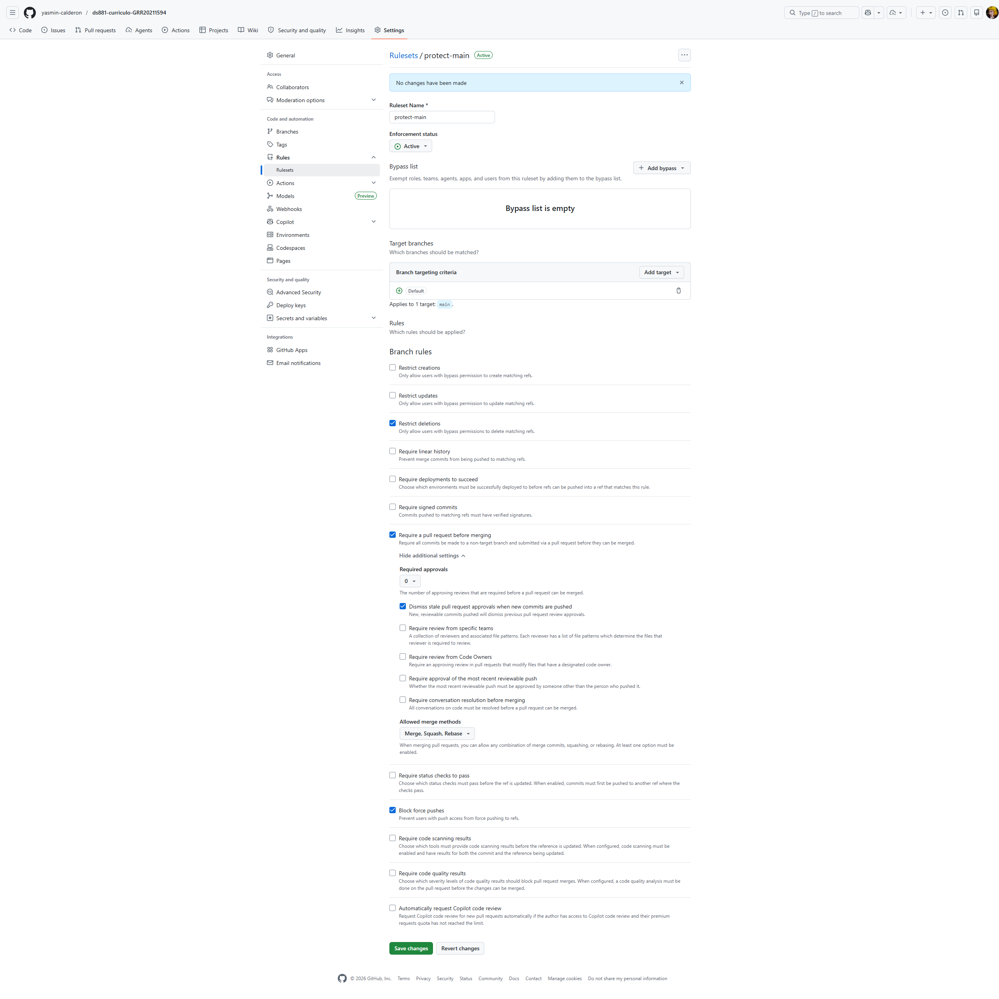

# Currículo Online — Yasmin Calderon

Currículo profissional estático, conteinerizado e publicado automaticamente no GitHub Pages a cada merge na `main`.

**Site em produção:** https://yasmin-calderon.github.io/ds881-curriculo-GRR20211594/

Projeto da disciplina **DS881 — Tópicos Especiais** (Análise e Desenvolvimento de Sistemas, UFPR). Exercício individual de conteinerização, pipeline CI/CD e governança de código.

---

## Stack

- **Aplicação:** HTML, CSS e JavaScript vanilla, empacotados com [Vite](https://vitejs.dev/) 5
- **Conteúdo:** `src/data.json` (fonte da verdade) + [GitHub REST API](https://docs.github.com/en/rest) para listar repositórios públicos
- **Tipografia:** DM Serif Display + Nunito (Google Fonts)
- **Ambiente de desenvolvimento:** Docker (`node:24-alpine`) + Docker Compose
- **CI/CD:** GitHub Actions (Lint → Build → Deploy para Pages)
- **Linters:** HTMLHint + Stylelint
- **Hospedagem:** GitHub Pages

---

## Estrutura

```
.
├── .github/workflows/main.yml   # Pipeline CI/CD (lint, build, deploy)
├── docs/
│   └── branch-protection.png    # Print da proteção da main
├── public/
│   └── curriculum-icon.png      # Favicon (servido como estático pelo Vite)
├── src/
│   ├── data.json                # Dados do currículo (fonte da verdade)
│   ├── main.js                  # Lógica de renderização + GitHub API
│   └── style.css                # Paleta e layout
├── index.html                   # Entry point Vite
├── Dockerfile                   # node:24-alpine + Vite dev server
├── docker-compose.yml           # Bind mount + porta 8080 + hot reload
├── vite.config.js               # Host/porta/polling para Docker
├── .htmlhintrc                  # Regras do HTMLHint
├── .stylelintrc.json            # Regras do Stylelint
└── package.json
```

---

## Como rodar localmente

### Opção 1 — Docker (recomendado)

Atende ao requisito de não precisar de Node.js instalado no host. Tudo roda dentro do container; só edita os arquivos no editor que o navegador atualiza sozinho.

**Pré-requisito:** [Docker Desktop](https://www.docker.com/products/docker-desktop/) instalado e em execução.

```bash
# Sobe o stack (primeira vez puxa a imagem node:24-alpine e instala deps; ~2 min)
docker compose up

# Abre no navegador:
# http://localhost:8080
```

Edite qualquer arquivo (`src/data.json`, `src/style.css`, etc.) e salve — o navegador recarrega automaticamente via hot reload.

Para parar: `Ctrl+C` no terminal e depois:

```bash
docker compose down
```

### Opção 2 — Node.js local

Caso prefira rodar direto na máquina (precisa de Node.js 24 LTS):

```bash
npm install
npm run dev
# Abre em http://localhost:5173 (porta padrão do Vite fora do Docker)
```

### Scripts disponíveis

| Comando | O que faz |
|---|---|
| `npm run dev` | Inicia servidor de desenvolvimento com hot reload |
| `npm run build` | Gera build de produção em `dist/` |
| `npm run lint` | Roda HTMLHint + Stylelint |
| `npm run lint:html` | Só HTML |
| `npm run lint:css` | Só CSS |

---

## Como atualizar o conteúdo

Todo o currículo é renderizado a partir de `src/data.json` — não precisa mexer no HTML, CSS ou JS para atualizar.

- **Editar dados de perfil, experiência, formação, skills:** edite `src/data.json` e salve.
- **Mudar quais repositórios aparecem:** o site lista automaticamente até 6 repositórios públicos do GitHub (campo `profile.githubUser`) que tenham **descrição preenchida** — funciona como auto-curadoria.
- **Visual / paleta:** todas as cores e fontes ficam centralizadas em `:root` no topo do `src/style.css`.

Após editar, abra um PR. O CI valida e, ao merge na `main`, o deploy é automático.

---

## CI/CD

Pipeline definido em [`.github/workflows/main.yml`](.github/workflows/main.yml). Roda em todo PR para `main` e em todo push direto (que, na prática, só acontece via merge de PR — push direto está bloqueado pela proteção).

```
┌──────┐    ┌───────┐    ┌────────────────────────────┐
│ Lint │ →  │ Build │ →  │ Deploy to GitHub Pages     │
│      │    │       │    │ (só em push para main)     │
└──────┘    └───────┘    └────────────────────────────┘
```

- **Lint** — HTMLHint valida o `index.html`; Stylelint valida `src/**/*.css`.
- **Build** — `vite build` em ambiente isolado (`ubuntu-latest`, `npm ci` a partir do lock), com `VITE_BASE_PATH` injetado dinamicamente como `/<nome-do-repo>/` para os assets resolverem no Pages.
- **Deploy** — usa as actions oficiais `actions/upload-pages-artifact` e `actions/deploy-pages`. Roda no environment `github-pages`, serializado por `concurrency: pages`.

Todas as actions estão em versões atuais com Node 24 nativo (sem warnings de depreciação).

---

## Governança

### Proteção da branch `main`

A `main` está protegida (Settings → Rules → `protect-main`) com:

- **Restrict deletions** — não é possível deletar a branch
- **Require a pull request before merging** — todo merge passa por PR
- **Require status checks to pass** — checks `Lint` e `Build` precisam estar verdes
- **Require branches to be up to date before merging** — PR precisa estar atualizado contra a `main` antes do merge
- **Block force pushes** — não é possível reescrever o histórico

Como resultado, **é impossível pushar direto na main** e **é impossível mergear um PR com CI vermelho**.



### Fluxo de trabalho

1. Cada mudança vive em uma branch separada (`feat/...`, `ci/...`, `docs/...`, `chore/...`)
2. Pull Request com descrição clara do que muda e por quê
3. CI roda (Lint + Build); precisa estar verde
4. Squash and merge na `main`
5. Deploy dispara automaticamente

### Conventional Commits

Todos os commits seguem o padrão [Conventional Commits](https://www.conventionalcommits.org/):

- `feat:` — nova funcionalidade
- `fix:` — correção
- `ci:` — mudanças no pipeline
- `chore:` — manutenção (setup, deps)
- `docs:` — documentação

---

## Autora

**Yasmin Calderon** — Análise e Desenvolvimento de Sistemas, UFPR (turma DS881)

- [LinkedIn](https://www.linkedin.com/in/yasmin-calderon)
- [GitHub](https://github.com/yasmin-calderon)
